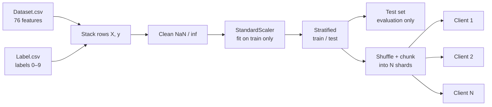
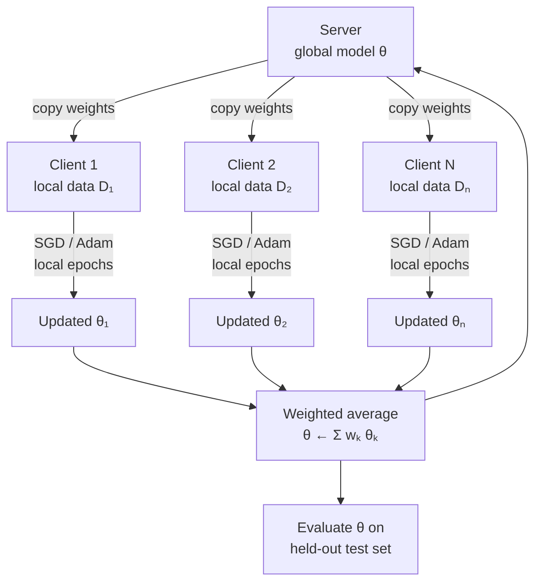
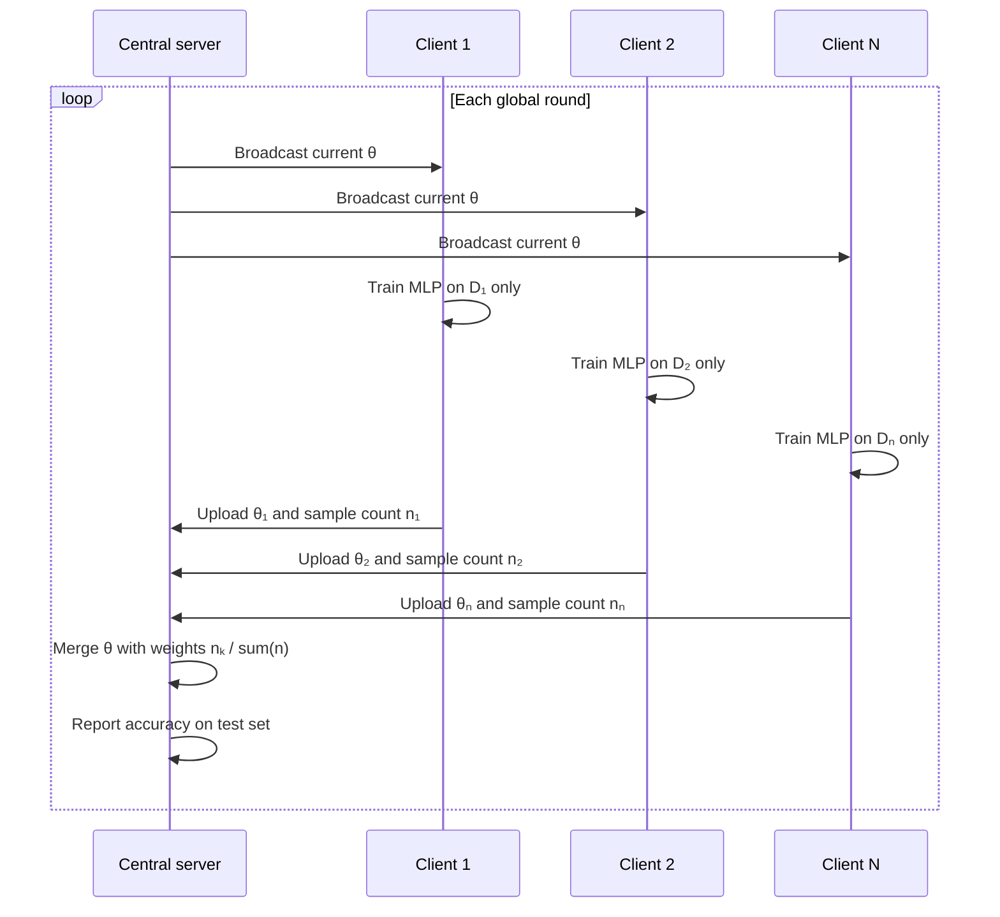

# Federated learning on CIC–UNSW-NB15 (augmented)

## Plain English — start here

Read this section first if the rest feels heavy.

**What problem are we solving?**  
Each row in the data is a snapshot of network traffic (lots of numeric measurements). The label says which of **10 categories** that traffic belongs to (for example, normal vs different kinds of suspicious activity). We want a small program (a **neural network**) that looks at the numbers and predicts the category.

**What does “federated” mean here?**  
In real life, different sites might not want to send all their raw traffic data to one central database. **Federated learning** means: each site keeps its own data, trains **the same kind of model** only on what it has, then sends **only the learned model numbers** (weights) to a central place. That place **combines** those models so everyone benefits without sharing the raw rows.

**What does *this* project actually do on your laptop?**  
Everything runs on **one machine**. The code **pretends** there are several separate “clients” by **splitting the CSV** into chunks. So it is a **simulation**: same idea as real federated learning, but no real separate computers or networks.

**What happens step by step in simple words?**

1. Load two files: features (`Dataset.csv`) and labels (`Label.csv`), line by line.
2. Clean the numbers and scale them so training is stable.
3. Set aside some rows as a **test set** — the model never trains on these; we only use them to **score** how good the final model is.
4. Split the remaining training rows into **N piles** (N fake “clients”).
5. Repeat many **rounds**:
   - Start from one **global** model.
   - Each pile trains its **own copy** of that model on **only its rows** for a few passes.
   - Combine all copies by a **weighted average**: piles with **more rows** get **more say** in the average.
   - Check accuracy on the test set.

**What is “weighted average” in one line?**  
When we merge the client models, we don’t treat every client equally if their data sizes differ: **bigger datasets get larger weights**, so the combined model reflects where most of the training data lived.

The sections below repeat the same story with more technical detail, tables, and diagrams.

---

This repository contains a **federated learning** experiment on the **CIC–UNSW-NB15 augmented** tabular dataset from Kaggle. Each simulated **client** trains a **neural network** only on its local data; a **server** combines client models using **FedAvg**—a **weighted average** of model parameters where weights match each client’s share of the training data.

---

## What this project does

| Piece | Description |
|--------|-------------|
| **Task** | Multi-class **intrusion / traffic classification** (10 classes, labels `0`–`9`). |
| **Model** | A small **MLP** (two hidden layers) implemented in **PyTorch**. |
| **Federated setup** | Training rows are split among **N clients**; no client sees another client’s raw rows. |
| **Aggregation** | After each round, the global model is updated as \(\theta \leftarrow \sum_k w_k \theta_k\) with \(w_k = n_k / \sum_j n_j\) (sample counts). This is the standard **FedAvg** rule. |

The main script is **`federated_unsw.py`**, which includes detailed **comments and docstrings** explaining each step.

---

## Visual overview

The diagrams below summarize **where data goes** and **what one federated round looks like**. GitHub and many Markdown previews render the Mermaid blocks automatically.

### End-to-end data path

From raw CSVs through preprocessing to clients and the held-out test set used only for evaluation:



### One global round (FedAvg)

The **server** holds the global MLP weights. Each **client** trains only on its shard; the server merges updates with **sample-count weights** \(w_k = n_k / \sum_j n_j\).



### Interaction view (optional)

A sequence-style view of the same round:


do 
---

## Step-by-step: what was done

The following is the sequence of work that produced this repo, in order.

### 1. Obtain the dataset (Kaggle)

The dataset was downloaded with the Kaggle CLI:

```bash
kaggle datasets download yasserhessein/cic-unsw-nb15-augmented-dataset --unzip
```

That produces CSV files in the project folder. For this pipeline we use:

- **`Dataset.csv`** — 76 numeric flow features per row (e.g. packet counts, IAT statistics, flags).
- **`Label.csv`** — One column, `Label`, with integer class IDs. Rows align **line-by-line** with `Dataset.csv`.

**`CICFlowMeter.csv`** is not used here: the same information is already represented in `Dataset.csv`, and the file can be very large. Using `Dataset.csv` + `Label.csv` keeps loading and training straightforward.

### 2. Define the learning problem

- **Inputs:** All feature columns from `Dataset.csv` (after cleaning non-finite values).
- **Outputs:** Class indices from `Label.csv` (10 classes).
- **Split:** A **stratified** train/test split (default **80% train / 20% test**) so class proportions stay similar despite imbalance. The test set is used only to **evaluate** the global model after each federated round.

### 3. Preprocessing

- **`StandardScaler`** is **fit on the entire training portion** of the features, then applied to every training row and to the test set.
- This is a **practical simplification** for a demo: in strict federated learning, clients might not pool raw data to compute global mean/variance; alternatives include secure aggregation of statistics or per-client normalization. The script’s docstrings note this assumption.

### 4. Simulate federated clients

- Training indices are **shuffled** (fixed seed for reproducibility), then split into **equal-sized chunks**—one chunk per client.
- That yields a roughly **IID** split across clients (each client sees a mix of classes). The code could be changed later for **non-IID** splits (e.g. each client gets only a subset of classes).

### 5. Neural network (local model)

- A **`MLPClassifier`** in PyTorch: input dimension = 76, hidden layers with ReLU, output dimension = 10 (logits for `CrossEntropyLoss`).
- **Every client uses the same architecture** so their parameter tensors can be averaged element-wise on the server.

### 6. Federated training loop (FedAvg)

For each **global round**:

1. **Broadcast:** Start from the current **global** model weights.
2. **Local training:** For each client, **copy** those weights, run **local training** (Adam, several **local epochs**, minibatches) **only** on that client’s `(X, y)`.
3. **Upload:** Collect each client’s **state dict** (all layer weights and biases).
4. **Aggregate:** Compute a **weighted average** of tensors: weight for client \(k\) is \(n_k / \sum_j n_j\), where \(n_k\) is the number of training samples on client \(k\). Equal-sized chunks give equal weights (e.g. 0.2 each for 5 clients).
5. **Evaluate:** Load the new global weights into the global model and measure **accuracy** (and a full **classification report** at the end) on the held-out test set.

This matches **Federated Averaging (FedAvg)** as commonly described in the literature.

### 7. Dependencies and entrypoint

- **`requirements.txt`** lists **PyTorch**, **pandas**, **scikit-learn**, and **numpy**.
- **`federated_unsw.py`** can be run as a script; **command-line flags** override client count, rounds, local epochs, batch size, learning rate, and device.

---

## Repository layout

| File | Role |
|------|------|
| `federated_unsw.py` | Loads data, builds clients, runs FedAvg, evaluates. **Comments explain each stage.** |
| `requirements.txt` | Python dependencies. |
| `Dataset.csv` / `Label.csv` | Dataset (from Kaggle); expected in the same directory as the script unless you change paths in code. |

---

## Setup

1. [Install the Kaggle CLI](https://github.com/Kaggle/kaggle-api) and place `kaggle.json` in `~/.kaggle/` if you still need to download the data.

2. Create a virtual environment (optional) and install dependencies:

```bash
cd /path/to/fed
pip install -r requirements.txt
```

3. If the CSVs are not present yet:

```bash
kaggle datasets download yasserhessein/cic-unsw-nb15-augmented-dataset --unzip -p .
```

---

## How to run

From the directory that contains `Dataset.csv`, `Label.csv`, and `federated_unsw.py`:

```bash
python federated_unsw.py
```

Defaults (see `Config` in the script): **5 clients**, **8 global rounds**, **2 local epochs**, batch size **512**, learning rate **1e-3**. The script picks **CUDA** automatically if available; otherwise **CPU**.

Examples:

```bash
python federated_unsw.py --rounds 10 --local-epochs 3 --clients 5
python federated_unsw.py --device cpu --batch-size 1024
```

---

## Output you should see

- Per-client **sample counts** and **FedAvg mixing weights** (should sum to 1).
- After each round: **global test accuracy**.
- At the end: **sklearn `classification_report`** (precision/recall/F1 per class).

**Note:** The dataset is **highly imbalanced** (one class has most samples). Overall accuracy can look strong while **minority classes** have low recall. Improving that would require class weights, resampling, or other techniques—separate from the federated mechanics demonstrated here.

---

## References

- McMahan, H. B., Moore, E., Ramage, D., Hampson, S., & y Arcas, B. A. (2017). *Communication-Efficient Learning of Deep Networks from Decentralized Data.* (FedAvg.)

---

## License

The Kaggle dataset page lists **Apache-2.0** for `yasserhessein/cic-unsw-nb15-augmented-dataset`. This example code is provided as-is for research and education.
